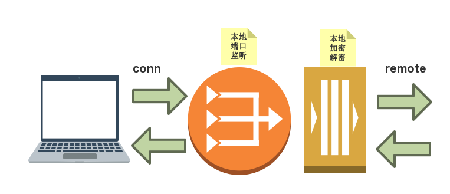

## 加密代理隧道

之前一共实现了两类代理。

* tcp层代理，可用于所有使用tcp协议的应用。http, ssh, ftp等
* 使用socks5代理。


下面讲对tcp的流式加密。并和socks5配合使用。


目录：51reboot/cryptoSocks5-V1/

### 1）中间件mycrypto.go

**结构体：**

* 封装一个Writer结构体，并提供rc4加密。
* 封装一个Reader结构体，并提供一个rc4加密。
* 并分别提供构造方法，以及对应的接口。

**测试**：

* 基准测试
* 性能测试

**代码：**

* ./mycrypto/mycrypto.go
* ./mycrypto/mycrypto_test.go


测试过程：

```shell
#### pwd : cryptoSocks5-V1

# cd mycrypto
# go test
PASS
ok  	github.com/jungle85gopy/learn-go/51reboot/cryptoSocks5-V1/mycrypto	0.009s

# go build
# echo "abcd" | ./mycrypto | ./mycrypto
abcd

#### 测试随机文件

# dd if=/dev/urandom of=./block.0 bs=1m count=20
20+0 records in
20+0 records out
20971520 bytes transferred in 1.967966 secs (10656444 bytes/sec)

# time ./mycrypto < block.0 > block.1
./mycrypto < block.0 > block.1  0.05s user 0.05s system 80% cpu 0.124 total 

# time ./mycrypto < block.1 > block.2
./mycrypto < block.1 > block.2  0.06s user 0.06s system 65% cpu 0.187 total

# ls -l block*
-rw-r--r--  1 song  staff  20971520 Aug 13 23:43 block.0
-rw-r--r--  1 song  staff  20971520 Aug 13 23:44 block.1
-rw-r--r--  1 song  staff  20971520 Aug 13 23:44 block.2

# md5 block*
MD5 (block.0) = 2f781e483d955a580eb407119972e348
MD5 (block.1) = 303d1985212c4eb20d06104e943d58b6
MD5 (block.2) = 2f781e483d955a580eb407119972e348
#### block.0和两次加密后的文件block.2相同。

#### 性能测试

# go test -bench .
go test -bench .
BenchmarkCrypto-4     500000	   2241 ns/op	 456.77 MB/s
PASS
ok  	github.com/jungle85gopy/learn-go/51reboot/cryptoSocks5-V1/mycrypto	1.156s
```

解释：

* 2241 ns/op单次时延，单位为纳秒
* 456.77 MB/s 每秒加密的流量


### 2）加密解密socks5隧道

加密解密过程


```shell
#### 示意图
user -/ client /--...net...--\ proxy -- socks5 \-- realServer
#用户--- 加密 ---- ........ --- 解密 -- socks5代理 -- 服务端
# 从client出来，到proxy收到，这中间是加密的。
```

加密解密之外，再实现socks5协议。上次的作业在实现socks5的基础，考虑了实现如上功能，结果只完成了client端。但对proxy的解密结果，不知道如何存储并传给下游。


**client端：**

* 对用户发来的数据，只对数据加密。发给远端代理服务器proxy
* 对远端proxy服务器发来的数据，进行解密，发送给用户

#### 2.1 加密处理

rc4对一块数据进行加密，并写入到另一个块中。关键是XORKeyStream方法。

回想打包和压缩中间件的处理过程。其实是对一个writer进行一次封装。这就是对流式处理，也能看到一切皆文件的unix哲学。

```shell
# tar数据流    ------>   disk_file
# tar数据流    --->( gz writer ) --->   disk_file
```

* 只打包时：
  * 是打开一个文件，得到fd
  * 然后使用tar.NewWriter(fd)
* 打包且压缩时：
  * compress := gzip.NewWriter(fd)
  * tr := tar.NewWriter(compress)
  * 先用压缩流封装fd，再用打包流封装压缩流

在考虑对sockets流进行加解密时。需要考虑数据Reader, Writer接口的差异(如下信息来自官方文档)：

* **Write(p []byte) (n int, err error)**
  * Write writes len(b) bytes from b to the underlying data stream
  * Write是将p中的数据写到被封装的Writer中去
* **Read(p []byte) (n int, err error)**
  * Read reads up to len(b) bytes into b
  * Read是从被封装的Reader中读数据到p中。

对数据流的加密与解决，就像是画皮，伪装成另一个角色，并代替其先进行数据的接收，再转发给被代替者。

**加密示意图：**



与前面说的压缩与打包相关。原本是conn与remote之间直接进行数据的copy操作。因为要加密和解密，过程变成这样：

* conn->remote加密：
  * 加密Writer封装remote
  * 将从conn端copy来的数据先加密
  * 再写给remote
* remote->conn加密：
  * 解密Reader封装remote
  * 将从remote读到的数据解密
  * 向conn写回的数据，来自解密Reader

#### 2.2 解密过程

解密过程与加密过程相反。虽然rc4是对称的，但通常还是把不对称的方式来处理，这样代码更通用。即：

**加密是统一对远端进行封装，而解密时统一对监听端进行封装。**虽然对于rc4，也可以按client端一样处理，直接对远端进行封装。相当于两次加密等于没有加密。——这里有点绕。上课时都没有想明白，课后自己考虑清楚的。

依然使用上面的图，但监听端口当成代理端口。

- conn->remote解密：
  - **解密Reader封装conn**
  - 将从conn端读到的数据解密
  - 再写给remote
- remote->conn加密：
  - **加密Writer封装conn**
  - 将从remote读到的数据写给Writer，则其加密
  - 由Writer数据流Copy到conn写回加密的数据


#### 运行观察


```shell
go run socks5/socks5.go		# -s=:8022

## 先只运行代理端。在浏览器的代理设置中使用8022端口。确认代理工作正常。

go run proxy/proxy.go 		# -c=:8021 -p=:8022
go run client/client.go 	# -c=:8020 -p=:8021

## 将代理改为8020端口。
# 之前工作不正常。是因为当时client, porxy都只使用了一个remote连接，这是不对的。因为每一个对client的请求，都应该建立一个单独的连接。
# 修改之后工作正常。

## 监听观察，8021端口的是加密数据，8022的是非加密数据

# dst 80 指其他端口送到80端口的数据，
# src 80 指来自80端口返回的数据，通道是服务器端
tcpdump -vv -i lo0 src port 8021 -X
tcpdump -vv -i lo0 dst port 8022 -X
```

