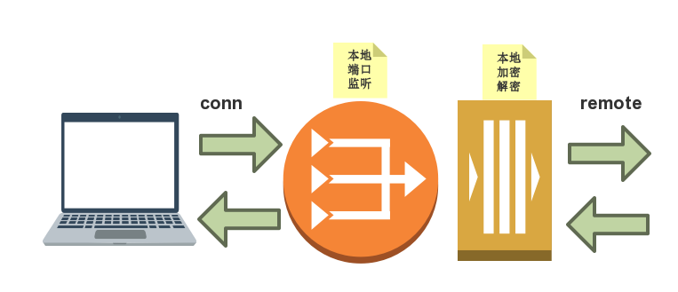

### crypto V3

V2版本的错误，已经在其[目录下说明](../cryptoSocks5-V2/crypto-v2.md)。

正确的版本，其思路应该是[V1版本](../cryptoSocks5-V1/cryptoSocks5.md)中的说明来实现。其实核心代码就2行。



这里再简述一下：

加密（以上图为加密端）：

* 对remote端进行Reader/Writer封装

解密（以上图为解密端）：

* 对conn端进行Reader/Writer封装


因此，就像在打包基础上压缩一样，对加密的数据进行解密也是一样的。原本是直接读写conn，现在变成对conn进行一层封装。

错误开始于：

```go
// 原本实现是这样的
r := bufio.NewReader(client)
addr, err := socks5Auth(r, client)

// 封装client连接
clientRd := mycrypto.NewCryptoReader(conn, key)
clientWr := mycrypto.NewCryptoWriter(conn, key)

rdBuf := bufio.NewReader(clientRd)
addr, err := socks5Auth(rdBuf, clientWr)

```

2017.08.17.