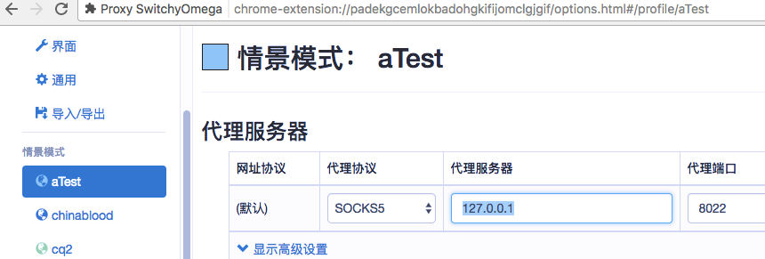

## 第10课 代理


### 代理服务器

**正向代理服务**

C要访问S。因为访问限制，不能直接访问。比如不能直接访问google。现使用代理程序p。

**( client -> proxy ) -> server**。s响应返回给p，p再将响应返回给c。

正向代理是**针对client端**的。

**反向代理服务**

服务端要提供访问。但为了安全，不将server直接暴露在公网上。而是将代理放在公网上，将服务放在代理的后端，通常在内网。原本的c -> s模式 变成了：

**client -> ( proxy  -> server)**。

对client来说，只能看到proxy。由其响应请求。

反向代理是针对于**server端**。


### 实现tcp层代理

tcpProxy/tcpProxy.go

#### 1 访问网页

server端

```shell
go run tcpProxy/tcpProxy.go --domain 'www.qq.com:80'
2017/08/06 17:10:10 domain:  www.qq.com:80
2017/08/06 17:10:12 start to handle conn...

2017/08/06 17:10:12 connect to domain: www.qq.com:80
2017/08/06 17:10:12 start to wait()...
2017/08/06 17:10:12 go wr start...
2017/08/06 17:10:12 go rd start...
2017/08/06 17:10:12 go rd end...
2017/08/06 17:10:13 start to handle conn...

2017/08/06 17:10:13 connect to domain: www.qq.com:80
2017/08/06 17:10:13 start to wait()...
2017/08/06 17:10:13 go wr start...
2017/08/06 17:10:13 go rd start...
2017/08/06 17:10:13 go rd end...
2017/08/06 17:10:29 start to handle conn...


go run tcpProxy/tcpProxy.go  --target=www.qq.com:80

curl -v 127.0.0.1:8021


```

client

```shell
curl  127.0.0.1:8021 >qq1.html
curl  127.0.0.1:8021 >qq2.html
ls -l qq1.html qq2.html
-rw-r--r--  1 song  staff  34379 Aug  6 17:13 qq1.html
-rw-r--r--  1 song  staff  34379 Aug  6 17:13 qq2.html
```

但是使用baidu, 163等网站却会导致curl端到8021的连接未关闭，应该是将第一个协程中的io.Copy(remote, conn)未正常结束。

#### 2 ssh访问

```shell
# server 
go run tcpProxy/tcpProxy.go --domain localhost:22
2017/08/06 17:16:21 domain:  localhost:22
2017/08/06 17:16:35 start to handle conn...

2017/08/06 17:16:35 connect to domain: localhost:22
2017/08/06 17:16:35 start to wait()...
2017/08/06 17:16:35 go wr start...
2017/08/06 17:16:35 go rd start...
2017/08/06 17:16:48 go wr end...
2017/08/06 17:17:00 go rd end...
2017/08/06 17:17:00 end of wait()...
2017/08/06 17:17:00 end of handle...
2017/08/06 17:17:02 start to handle conn...

## client
nc  127.0.0.1 8021
SSH-2.0-OpenSSH_7.2
ssh song@localhost
Protocol mismatch.
^C
```

看上去是使用方法不对。需要再研究一下。


### socks5 代理

上面的tcp代理，可以进行tcp层的所有代理，但在使用上，默认指点了目标域名。对多个域名的访问，操作上不方便。下午实现socks5代理。


#### 安装：switchyomega

* https://switchyomega.com/
* https://switchyomega.com/download.html

下载后，是个switchyomega.crx文件。

`在 Chrome 地址栏输入 chrome://extensions 打开扩展程序，拖动 .crx 后缀的 SwitchyOmega 安装文件到扩展程序中进行安装。`




#### 实现代理

参考：http://www.jianshu.com/p/172810a70fad


* 双方握手 handshake()
  * 正常情况，还需要认证。
  * 1字节，表示版本
  * 1字节。表示第二字段的方法。
* 获取客户端代理请求
* 开始代理


如果不是使用的ip，而是使用域名，则域名长度，需要一个前置的字节来表示长度。

Atpe。如果是ip。则ipv4是4字节，ipv6是16字节。如果是域名，如上所述。


将端口加入代理中。如前面截图所示。用web访问任意域名。观察代理日志。

```shell
go run ./socks5/socks5.go
2017/08/06 19:43:13 new connection from 127.0.0.1:50724
2017/08/06 19:43:13 start handle ...
2017/08/06 19:43:13 version:5
2017/08/06 19:43:13 nmethods: 1
2017/08/06 19:43:13 [0]
2017/08/06 19:43:36 new connection from 127.0.0.1:50773
2017/08/06 19:43:36 start handle ...
2017/08/06 19:43:36 version:5
2017/08/06 19:43:36 nmethods: 1
2017/08/06 19:43:36 [0]

```

测试对于**非https网站可以工作**，但对于https类的网站。代理会失败。


另一个测试方法，不通过switchyomega，直接使用命令：

```shell
curl -v --socks5-hostname 127.0.0.1:8022 http://www.163.com/
```


其他机器可以使用如下的方式来连接提供代理的机器

```shell
netstat -na | grep 8021
###  null

ssh -D 192.168.1.108:8022 song@localhost
Password:
Last login: Sun Aug  6 17:05:15 2017 from ::1
#  new tty

```


### 加密

对称与非对称。

#### rc4对称加密

**示例1：加密“hello”串**

```shell
# go run encrypt/rc4-1base.go
2017/08/06 21:39:13 crypt#:h�
                             K#
2017/08/06 21:39:13 hello
```

使用同一个密钥进行加密和解密。


**示例2：加密“hello”串**

```shell
# go run encrypt/rc4-2md5.go
2017/08/06 21:40:43 �kǞr
2017/08/06 21:40:43 hello
```


