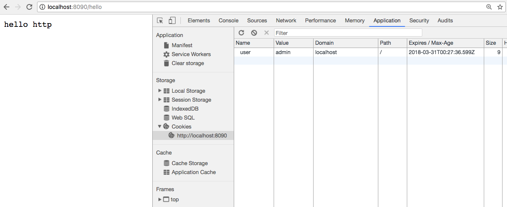

## hello golang web

### 1 空服务器

```go
func main() {
	log.Fatal(http.ListenAndServe(":8090", nil))
}
```

一行代码即可以启动一个空的服务器。并可以运行。只是这个服务器对任何请求都返回404。

### 2 hello

对/hello进行响应。使用**http.HandleFunc**来绑定路由。

代码：hello/hello.go

也可以通过**http.Handle**进行对象的绑定。对象需要实现一个**Handler**的接口，即需要实现**ServeHTTP**函数。


### 3 账号登陆

code:

- main.go
- template/list.html.tpl
- template/list.tpl
- template/login.tpl

实现过程：

- 先实现一个没有页面的Hello()
- 实现登陆页面/login，使用Login()，需要用到login.tpl。
  - 将读取tpl文件并渲染的过程写成render()函数
- 实现检查表单/checklogin，使用checkLogin()
  - 通过r.ParseForm()进行解析，并读取账号信息。
  - 实现跳转功能。`http.Redirect(w, r, "/list", 302)`
  - 尝试使用http.Cookie记录登陆信息。


### 4 cookie

code: cookie.go

```shell
# go run cookie.go &

#### 错误登陆验证
# curl -v 'localhost:8090/checkLogin?user=admin&password=admi'
*   Trying ::1...
* Connected to localhost (::1) port 8090 (#0)
> GET /checkLogin?user=admin&password=admi HTTP/1.1
> Host: localhost:8090
> User-Agent: curl/7.49.1
> Accept: */*
>
< HTTP/1.1 200 OK
< Date: Sat, 31 Mar 2018 00:32:54 GMT
< Content-Length: 37
< Content-Type: text/plain; charset=utf-8
<
* Connection #0 to host localhost left intact
name:admin,password:admi, login error

#### 正确的登陆验证

# curl -v 'localhost:8090/checkLogin?user=admin&password=admin'
*   Trying ::1...
* Connected to localhost (::1) port 8090 (#0)
> GET /checkLogin?user=admin&password=admin HTTP/1.1
> Host: localhost:8090
> User-Agent: curl/7.49.1
> Accept: */*
>
< HTTP/1.1 302 Found
< Content-Type: text/html; charset=utf-8
< Location: /hello
< Set-Cookie: user=admin; Max-Age=10
< Date: Sat, 31 Mar 2018 00:32:45 GMT
< Content-Length: 29
<
<a href="/hello">Found</a>.

* Connection #0 to host localhost left intact
```

上面的请求，能看到设置的cookie信息：`Set-Cookie: user=admin; Max-Age=10`。但是因为命令行没有记录保存功能。每次请求都是一样的，而且再请求hello页时，看不到有cookie。

下面是用浏览器的观察结果：多次刷新hello页且超过10秒后，相应的cookie就消失了。




#### cookie跳转

修改Hello()，先检查是否有cookie，如果没有则跳转到/login。

```shell

# curl -v 'localhost:8090/hello'
*   Trying ::1...
* Connected to localhost (::1) port 8090 (#0)
> GET /hello HTTP/1.1
> Host: localhost:8090
> User-Agent: curl/7.49.1
> Accept: */*
>
< HTTP/1.1 302 Found
< Content-Type: text/html; charset=utf-8
< Location: /login
< Date: Sat, 31 Mar 2018 00:44:46 GMT
< Content-Length: 29
<
<a href="/login">Found</a>.

* Connection #0 to host localhost left intact
```

通过浏览器也能观察到跳转效果。


code: hello/cookie-main.go (这是课上的cookie)


### 5 session

#### 5.1 hello/session-main.go

使用session。但这个课堂上的代码有点问题，正常登陆后，没有成功跳转到hello页面。


#### 5.2 hello/session.go

```shell
# go run hello/session.go

# url -v 'localhost:8090/checkLogin?user=admin&password=admin'
*   Trying ::1...
* Connected to localhost (::1) port 8090 (#0)
> GET /checkLogin?user=admin&password=admin HTTP/1.1
> Host: localhost:8090
> User-Agent: curl/7.49.1
> Accept: */*
>
< HTTP/1.1 302 Found
< Content-Type: text/html; charset=utf-8
< Location: /hello
< Set-Cookie: web=MTUyMjQ2NDM3MnxEdi1CQkFFQ180SUFBUkFCRUFBQUlfLUNBQUVHYzNSeWFXNW5EQVlBQkhWelpYSUdjM1J5YVc1bkRBY0FCV0ZrYldsdXxmHKImB7FsH8XDpwdPlQEhVBZoVqVdC6pNmygt2StPJg==; Path=/; Expires=Sat, 31 Mar 2018 02:46:22 GMT; Max-Age=10
< Date: Sat, 31 Mar 2018 02:46:12 GMT
< Content-Length: 29
<
<a href="/hello">Found</a>.

* Connection #0 to host localhost left intact
```

从请求返回包头中可以看到如下`Set-Cookie`相关的信息。其中包括名叫web的key及其加密过的值。其后还有其他变量：

* Path=/;
* Expires=Sat, 31 Mar 2018 02:46:22 GMT;
* Max-Age=10


### 6 mysql driver

其中有init会初始化注册一个"mysql".
使用的是database.sql.Register("mysql", &xxxx)

`_ "github.com/go-sql-driver/mysql"`方式引用一个包。在main函数之前会被调用一次。

引用一个包而又不用这个包，就可以使用这种方式。
实际上是使用了这个包中的init函数。

关于driver：

* database/sql中定义是的操作数据库的接口。没有具体实现驱动
* go-sql-driver/mysql是mysql的一个驱动实现。通过`-`方式引用而执行其init()函数
* init中完成了将驱动加载全局注册表。其driver.go中的init()就一行:
* `sql.Register("mysql",&MysqlDriver{})`

mysql常用连接方法：

* 连接：`db, err := sql.Open("mysql", "user:pwd@tcp(IP:3306)/DB")`
* 读取：http://localhost:6060/pkg/database/sql/#DB.Query
  * 读取一行：`db.QueryRow("SELECT username FROM users WHERE id=?", id).Scan(&username)`
  * 读取多行：`rows, _ := db.Query("SELECT * FROM user")`

具体参考：hello/mysql-main.go


#### 6.1 读写用户账号

参考：

* hello/prepare-main.go
* hello/add-main.go

功能点：

* 实现Add()函数。将添加的用户插入到数据库。
* 修改CheckLogin()函数，登陆时读数据库并进行检验。

#### 6.2 sqlite3

```go
{
    import _ "github.com/mattn/go-sqlite3"

    db, err := sql.Open("sqlite3", "web.db")
    if err != nil {
        log.Fatal(err)
    }
    db.Ping()
}
```

#### 6.3 checkLogin()

```shell

# CheckLogin usage:
curl http://localhost:8090/checkLogin?user=admin&password=admin

```
#### 6.4 Add()

usage 
```shell

curl http://localhost:8090/add?name=adminni&password=admin&isadmin=0&note=hello,administrator
# null
# 200 

curl http://localhost:8090/add?name=admin&password=admin&isadmin=0&note=hello,administrator
# Error 1062: Duplicate entry 'admin' for key 'name'
# 500

```

#### 6.5 msql table

mysql

```mysql
CREATE TABLE `user` (
`id`  int(11) UNSIGNED NOT NULL AUTO_INCREMENT ,
`name`  char(15) CHARACTER SET utf8 COLLATE utf8_general_ci NOT NULL DEFAULT '' ,
`password`  char(32) CHARACTER SET utf8 COLLATE utf8_general_ci NOT NULL DEFAULT '' ,
`note`  varchar(40) CHARACTER SET utf8 COLLATE utf8_general_ci NOT NULL DEFAULT '' ,
`isadmin`  tinyint(1) NOT NULL ,
PRIMARY KEY (`id`),
UNIQUE INDEX `name` (`name`) USING BTREE
)
ENGINE=InnoDB
DEFAULT CHARACTER SET=utf8 COLLATE=utf8_general_ci
AUTO_INCREMENT=6
ROW_FORMAT=COMPACT
;
```

#### 6.6 多条记录查询

单条循环会比较慢，可以使用prepare，加快处理速度。

```go
stmt, err := db.Prepare("INSERT INTO user VALUES(NULL, ?, ?, ?,?)")
stmt.Exec(name, passwd, note, 1)
stmt.Exec(name, passwd, note, 1)
// 每Exec执行一次就插入一行
```


### debug pprof

http://localhost:8090/debug/
http://localhost:8090/debug/pprof/
http://localhost:8090/debug/pprof/goroutine?debug=1

```shell

go tool pprof http://localhost:8090/debug/pprof/heap
Fetching profile from http://localhost:8090/debug/pprof/heap
Saved profile in /Users/song/pprof/pprof.localhost:8090.alloc_objects.alloc_space.inuse_objects.inuse_space.001.pb.gz
Entering interactive mode (type "help" for commands)
(pprof) top
1.16MB of 1.16MB total (  100%)
Showing top 10 nodes out of 12 (cum >= 1.16MB)
      flat  flat%   sum%        cum   cum%
    1.16MB   100%   100%     1.16MB   100%  runtime/pprof.writeGoroutineStacks
         0     0%   100%     1.16MB   100%  github.com/gorilla/handlers.(*loggingHandler).ServeHTTP
         0     0%   100%     1.16MB   100%  github.com/gorilla/handlers.loggingHandler.ServeHTTP
         0     0%   100%     1.16MB   100%  net/http.(*ServeMux).ServeHTTP
         0     0%   100%     1.16MB   100%  net/http.(*conn).serve
         0     0%   100%     1.16MB   100%  net/http.HandlerFunc.ServeHTTP
         0     0%   100%     1.16MB   100%  net/http.serverHandler.ServeHTTP
         0     0%   100%     1.16MB   100%  net/http/pprof.Index
         0     0%   100%     1.16MB   100%  net/http/pprof.handler.ServeHTTP
         0     0%   100%     1.16MB   100%  runtime.goexit
(pprof)


```

热点分析

启动如下命令后，处于30秒收集信息中。
可以多次在浏览器中访问某些页面。如counter，list

```shell

go tool pprof http://localhost:8090/debug/pprof/profile
Fetching profile from http://localhost:8090/debug/pprof/profile
Please wait... (30s)
Saved profile in /Users/song/pprof/pprof.localhost:8090.samples.cpu.002.pb.gz
Entering interactive mode (type "help" for commands)
(pprof) top
20ms of 20ms total (  100%)
Showing top 10 nodes out of 14 (cum >= 10ms)
      flat  flat%   sum%        cum   cum%
      10ms 50.00% 50.00%       10ms 50.00%  runtime.kevent
      10ms 50.00%   100%       10ms 50.00%  runtime.mach_semaphore_wait
         0     0%   100%       20ms   100%  runtime.findrunnable
         0     0%   100%       10ms 50.00%  runtime.goexit0
         0     0%   100%       20ms   100%  runtime.mcall
         0     0%   100%       10ms 50.00%  runtime.netpoll
         0     0%   100%       10ms 50.00%  runtime.notesleep
         0     0%   100%       10ms 50.00%  runtime.park_m
         0     0%   100%       20ms   100%  runtime.schedule
         0     0%   100%       10ms 50.00%  runtime.semasleep
(pprof) top10
20ms of 20ms total (  100%)
Showing top 10 nodes out of 14 (cum >= 10ms)
      flat  flat%   sum%        cum   cum%
      10ms 50.00% 50.00%       10ms 50.00%  runtime.kevent
      10ms 50.00%   100%       10ms 50.00%  runtime.mach_semaphore_wait
         0     0%   100%       20ms   100%  runtime.findrunnable
         0     0%   100%       10ms 50.00%  runtime.goexit0
         0     0%   100%       20ms   100%  runtime.mcall
         0     0%   100%       10ms 50.00%  runtime.netpoll
         0     0%   100%       10ms 50.00%  runtime.notesleep
         0     0%   100%       10ms 50.00%  runtime.park_m
         0     0%   100%       20ms   100%  runtime.schedule
         0     0%   100%       10ms 50.00%  runtime.semasleep
(pprof) top20
20ms of 20ms total (  100%)
      flat  flat%   sum%        cum   cum%
      10ms 50.00% 50.00%       10ms 50.00%  runtime.kevent
      10ms 50.00%   100%       10ms 50.00%  runtime.mach_semaphore_wait
         0     0%   100%       20ms   100%  runtime.findrunnable
         0     0%   100%       10ms 50.00%  runtime.goexit0
         0     0%   100%       20ms   100%  runtime.mcall
         0     0%   100%       10ms 50.00%  runtime.netpoll
         0     0%   100%       10ms 50.00%  runtime.notesleep
         0     0%   100%       10ms 50.00%  runtime.park_m
         0     0%   100%       20ms   100%  runtime.schedule
         0     0%   100%       10ms 50.00%  runtime.semasleep
         0     0%   100%       10ms 50.00%  runtime.semasleep.func1
         0     0%   100%       10ms 50.00%  runtime.semasleep1
         0     0%   100%       10ms 50.00%  runtime.stopm
         0     0%   100%       10ms 50.00%  runtime.systemstack
(pprof)

```

### 路由分发器

ServeMux
DefauleServeMux

```go
    // style 1
	log.Fatal(http.ListenAndServe(":8090", nil))

    // style 2
	h := handlers.LoggingHandler(os.Stderr, http.DefaultServeMux)
	log.Fatal(http.ListenAndServe(":8090", h))

```

### Handler and HandlerFunc

http.HandlerFunc 是函数，使用http.HandleFunc挂载。
http.Handler是接口，使用http.Handle挂载

转换关系：
比如Login()是一个处理函数，如何转换成接口来挂载
http.HandlerFunc(Login) -> http.Handler


