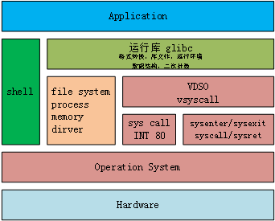

## system info for goroutine

[refer from](http://blog.jobbole.com/35304/)

### 1 OS and running library

示意图：

###### 

VDSO virtual dynamic shared object.随内核发行但不在内核态
简单调用直接由glibc提供，其它由VDSO提供接口并决定后继调用接口
对VDSO，fork走INT80，getuid走syscall.

linux: http://syscalls.kernelgrok.com/
win: http://j00ru.vexillium.org/ntapi/
VDSO: http://lwn.net/Articles/446528/

### 2 并发与并行

并发：concurrency

并行：parallelism

**并发**：是指程序表态的**时序可重叠的逻辑结构**。对应的是**顺序的(Sequential)结构**。顺序的结构表达只有一个逻辑控制流，只能从前到后的顺序执行。而并发表示的时序流程图可以有多个独立的逻辑分支。这些独立的分支中可以同时处理（deal）多件的。

比如说安排一个人做一顿饭，计划中就包括：买菜，用电饭煲煮饭，准备菜碗，择菜，洗菜，切菜，炒菜，等等过程。洗菜切菜是需要顺序执行的，但煮饭和洗菜是可以同时处理的，即在时间线上是可能重叠的，这个就是并发。

**并行**：并行是指程序的运行状态，即程序在一个时刻被多个CPU流水线**同时进行**处理。这种运行状态称为程序是并行的。并行是需要硬件(CPU)级别的支持才行。对就的是**顺序执行**。

**两者的关系**：

* 并发是并行的必要条件。在逻辑上不能拆分成并发的时序流程，则只能串行执行，不能并行。
* 并发并不是并行的充分条件。一个写成并发的程序，只在一个CPU流水线上执行时，也不是并行的，即前面说的，需要硬件的支持。
* 并发只是一种描述问题的表达方式，主要是为了简化代码逻辑，而不是提高运行速度。

**如何并发**：

* 显示定义并触发多个代码片段（逻辑控制流），然后由应用程序或者OS进行调度。
* 隐示定义放置多个代码片段，在系统事件发生时触发执行相应片段。即由事件驱动。

**如何并行**：

* 多CPU。最常用的方式。包括多核或者超线程。

* 多机如map reduce，或者编译器级别的指令级并行，单指令多数据。

  ​

### 3 线程的调度

线程是最真观的并发的实现。在单核条件下，多线程是分时执行的，在多CPU条件下，则就是并行执行了。

这里需要区分一下进程和线程。进行是资源的**分配单位**，隔离了执行环境，而线程才是真正执行时的**调度单位**，是独立的执行序列。

要理解线程的调度，需要从INTEL的架构说起。CPU通过CS:EIP寄存器的值来确定下一条指令的位置。而这个寄存器的修改，不能直接通过mov指令，而必须是JMP, CALL/RET指令，或者INT中断来实现代码的跳转。（省略各寄存器状态的保存与恢复）

对于单核的CPU，内核是与应用程序共享一个CPU。当EIP在应用程序时，内核没有控制权。内核并不是一个进程或线程，内核只是在实模式下，代码段权限为RING 0的内存中的程序。在内核中，所有代码都在一个地址空间。

为了进行线程的调度，内核为每个线程建立一个内核堆栈，这是内核切换线程的关键。

**调度的时机：**

* 时钟中断时，
* 系统调用返回时

**线程调度过程**：

* 计算当前线程的剩余时间片，如果需要切换：
* 从“可运行”的线程队列里计算优先级，选出目标线程
* 保存当前线程的运行环境
* 恢复目标线程的运行环境，特别是堆栈指针ESP
* 修改EIP为目标线程上次被移动CPU时的指令地址
* 然后RET或JMP。

在返回目标线程时，**Linux实现的返回机制**：

* ESP切换到目标线程的内核栈
* 将目标线程的EIP地址压栈
* JMP _switch_to()，伪造一个CALL指令
* 在_switch_to()的最后，使用RET返回
* 这样在RET时，目标线程的EIP地址从栈中写入到EIP寄存器
* 目标线程运行

注：上述忽略了TSS相关的细节。

#### 多核情况

现代PC通常是多CPU（physical package,物理封装），每颗CPU有多个核（processor core），每个core又可以支持超线程(two logical processor for each core)——即逻辑处理器。每个逻辑处理器都有自己的一套完事的寄存器。

从OS和应用的角度，每个逻辑处理器都是一个单独的流水线。线程切换时，内核进行寄存器环境的切换。如果程序用线程实现了并发，则OS即可使程序在多个CPU上实现并行。

对于多核情况下的中断：

* 软中断(除0，缺页，INT)触发对应CPU的中断
* 硬中断：
  * 时钟：每个CPU自己处理
  * 外中断：需要通过APIC绑定CPU，使中断均匀分配到CPU，

### 4 并发编程框架

上面是通过OS的线程调度来达到单CPU下的并发。这个代码段或者叫任务，也是可以通过应用程序自己来调度和切换。

因此可以通过一个调度程序，进行循环的选取任务进行调度。这里需要解决几个问题：

* **调度**。schedule()程序本身在用户态，没有中断或系统调试来打断任务的执行。任务启动后，不会再回到schedule()。需要任务主动调用schedule()。即协作式调度。
* **堆栈**。需要为每个任务分配堆栈，并保存在任务属性里，一般分配在堆空间上。这样没有任务总数的限制。
* 等待IO。使用非阻塞方式。并让出CPU。
* 任务同步。封装read, write函数，数据没有准备好则调用schecule()让出CPU。 

goroutine是Go运行库的功能，而不是OS提供的功能。

goroutine是一段代码，对应一个函数入口及堆上的堆栈。

goroutine是协作式调度，需要调动调用Gosched()让出CPU。

### 5 并发与并行——Rob Pike

Concurrency is **dealing** lots of things at once.

Parallelism is **doing** lost of things at once. Not the same, but related.

one is about structure and one is about execution. 

concurrency is not parallelism, although it enables parallelism.

if you have only one processor, you program can still be concurrent but it cannot be parallel.

on the other hand, a well-written concurrent program might run efficently in parallel on a multiprocessor. 

基于事件驱动模型，可以解决单台机器的C10K问题。这只是并发，是基于事件模型，以最小的性能开销解决了大规模并发的问题。这也是某一时间**dealing**多少链接。不是doing**多少**链接。

[doc](https://blog.golang.org/concurrency-is-not-parallelism)

[slice](https://talks.golang.org/2012/waza.slide#1)

