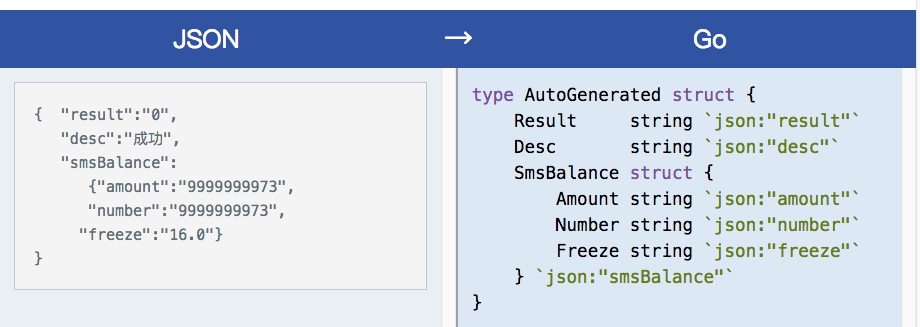

## json decode 解码

从byte数组转换为结构体。

refer: https://www.jianshu.com/p/31757e530144


### de1Base.go 基本用法

通过Unmarshal与结构体进行解码。

Unmarshal的第二个参数是一个空的接口指针。通常有2个办法来得到：

* var 定义该结构体变量，或者直接` ac := Account{}`，使用`&ac`传参
* new一个结构体，直接得到指针`ac :=new(Account)`，使用`ac`传参

```shell
#go run de1Base.go
{Email:rsj217@gmail.com Password:123 Money:100.5}
```


###  de2Var.go tag变化用法

示范变化：

* PassWord字段是可见的前提下。不使用tag。
  * json的password可以匹配到PassWord，匹配不区分字段的大小写
* passWord字段不可见，使用tag。
  * json的password可以匹配到passWord，匹配不区分字段的大小写
  * 大小写不敏感只是针对公有字段而言
* 不存在Money字段
  * 寻找tag或字段的时候匹配不成功，则会抛弃这个json字段的值

以上三种情况分别对应如下三行输出：

```shell
#go run de2Var.go
{Email:rsj217@gmail.com PassWord:123 Money:100.5}
{Email:rsj217@gmail.com passWord: Money:100.5}
{Email:rsj217@gmail.com Password:123}
```


### de3String.go string tag

使用string tag：

* 可以将结构体中的数据编码成json时，变成字符串
* 可以将json中的数字字符串，解码成结构体中的数字
  * 如果json中的不是字符串，则解码将得到0值。

这样可以避免更多的显式转换。

```shell
#go run de3String.go
main.Account{Email:"rsj217@gmail.com", Password:"123", Money:100.5}
main.Account{Email:"rsj217@gmail.com", Password:"123", Money:0}
```


### de4Omit.go 忽略`-`tag

被`-`标识的字段将不被解析，该字段的值被初始化为零值。

```shell
#go run de4Omit.go
{Email:rsj217@gmail.com Password:123 Money:0}
```


### json-to-go工具

域名：https://mholt.github.io/json-to-go/

示例：




### dyn1NewDecode.go 动态解析

使用json.NewDecoder从数据流中构造出一个Decode对象，由这个对应的Decode方法将结果解码到目标结构体。

数据流可以使用strings.NewReader从[]byte数组读取。

```shell
#go run dyn1NewDecode.go
2018/03/28 09:43:26 &main.User{UserName:"rsj217@gmail.com", Password:"123"}
```


### dyn2Interface.go 动态接口

上一个实例的UserName是使用的邮箱，类型是字符串。但实际的用户账号，可能是邮箱；也可能是手机号，并且是当成一个数字。此时使用interface解析。并根据不同的类型进行断言。

```shell
#go run dyn2Interface.go
2018/03/28 22:19:27 &main.User{UserName:"rsj217@gmail.com", Password:"123"}
2018/03/28 22:19:27 &main.User{UserName:18612349876, Password:"123"}
```


